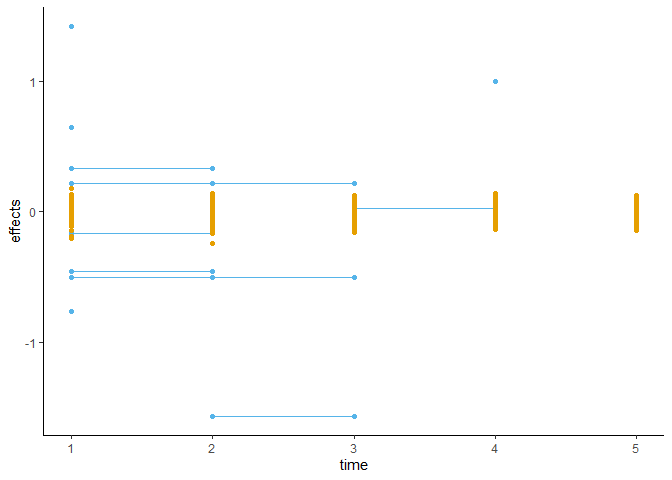

ULPS guide
================
Kalle Leppälä
August 18, 2022

This is a tutorial of the R package *ULPS* (Uniform Longitudinal
Phenotype Simulator) (Leppälä [2022](#ref-ULPS)). You can simulate
phenotypes from genotypes at sequential time points (or along other axis
such as latitude), while controlling for the levels of variance
additively explained by the genotypes and residual variance. You can
allow or prohibit causal loci and their effect sizes changing with time,
which can reflect phenotypic plasticity and interaction with unobserved
variables. The residual autocorrelation is modelled as a Gaussian
process.

You can install ULPS by using functions like install.github() or
something, we need to check that. You also need to have
[*corpcor*](https://CRAN.R-project.org/package=corpcor) (Schäfer and
Strimmer [2005](#ref-schafer2005shrinkage); Opgen-Rhein and Strimmer
[2007](#ref-opgen2007accurate)),
[*ggplot2*](https://CRAN.R-project.org/package=ggplot2) (Wickham
[2016](#ref-ggplot2)) and
[*fields*](https://CRAN.R-project.org/package=fields) (Douglas Nychka et
al. [2021](#ref-fields)) installed. The four packages are loaded and
attached with:

``` r
library(ULPS)
library(corpcor)
```

    ## Warning: package 'corpcor' was built under R version 4.0.5

``` r
library(ggplot2)
```

    ## Warning: package 'ggplot2' was built under R version 4.0.5

``` r
library(fields)
```

    ## Warning: package 'fields' was built under R version 4.0.4

    ## Loading required package: spam

    ## Warning: package 'spam' was built under R version 4.0.4

    ## Loading required package: dotCall64

    ## Warning: package 'dotCall64' was built under R version 4.0.4

    ## Loading required package: grid

    ## Spam version 2.6-0 (2020-12-14) is loaded.
    ## Type 'help( Spam)' or 'demo( spam)' for a short introduction 
    ## and overview of this package.
    ## Help for individual functions is also obtained by adding the
    ## suffix '.spam' to the function name, e.g. 'help( chol.spam)'.

    ## 
    ## Attaching package: 'spam'

    ## The following objects are masked from 'package:base':
    ## 
    ##     backsolve, forwardsolve

    ## See https://github.com/NCAR/Fields for
    ##  an extensive vignette, other supplements and source code

## Example data

As an example in this tutorial we use the
[*AdaptMap*](https://datadryad.org/stash/dataset/doi:10.5061/dryad.v8g21pt)
data set (Bertolini et al. [2018](#ref-bertolini2018signatures)). The
data consist of 4653 domestic goats (Capra hircus) representing 144
breeds from around the world, genotyped at 53347 loci.

To save time and space, we restricted to common variants on chromosomes
1–3 using the PLINK command:

``` sh
.\plink --bfile ADAPTmap_genotypeTOP_20160222_full --chr-set 29 --chr 1-3 --maf 0.01 --recode A --out goats
```

We imported the genotype matrix to R, used mean imputation for missing
entries, scaled and performed a principal component analysis using the R
commands:

``` r
table <- read.table("goats.raw", sep = " ", header = TRUE)
rownames(table) <- table[, 2]
popnames <- table[, 1]
table[, 1:6] <- NULL
for (i in 1:NCOL(table)){
  table[is.na(table[, i]), i] <- mean(table[, i], na.rm = TRUE) # Mean imputing NA:s.
}
table <- scale(table) # Scaling the columns to have zero mean and unit variance.
table <- table[, colSums(is.na(table)) == 0] # One variant was monomorphic and therefore now missing.
save(table, file = "table.RData")
GRM <- table %*% t(table) # Relationship matrix.
eigen <- eigen(GRM) # Its eigendecomposition.
pca <- data.frame(PC1 = eigen$vectors[, 1], PC2 = eigen$vectors[, 2], population = popnames)
save(pca, file = "pca.RData")
```

The genotype matrix `table` now contains the 4653 goats as rows and 8414
genetic variants as columns. The data frame `pca` contains the first two
principal component loadings and the breeds of each goat. These data are
loaded with:

``` r
data(table)
data(pca)
```

We observe that the goat data is highly structured using the PCA plot.

``` r
ggplot(pca, aes(x = PC1, y = PC2, fill = population)) +
  ggtitle("PCA of the goat data based on chromosomes 1\u20133") +
  xlab("PC 1") +
  ylab("PC 2") +
  theme_classic() +
  geom_point(pch = 21, show.legend = FALSE)
```

<!-- -->

## The model

The underlying model of *ULPS* is \[
Y_t = C_t + X\beta_t + \varepsilon_t,
\] where \(Y_t\) are the N phenotypes at time point \(t\), \(X\) is the
centered and scaled N x P genotype matrix, \(\beta_t\) is the vector of
P genetic effects, \(C_t\) are other observed effects at time point
\(t\), and \(\varepsilon_t\) is the vector of residuals, each generated
independently by a Gaussian process over time. The phenotypic variance
causally explained by the term \(X\beta_t\) is \(\beta^{\top} R \beta\),
where \(R\) is the linkage disequilibrium matrix between the variants.
Note that \(C_t\) and \(X\) need not be independent, in which dividing
the causally explained variance by the total phenotypic variance doesn’t
equal additive heritability, which is typically defined as as the
maximum amount of varianxce that can be linearly predicted from \(X\).

The phenptype is created by the function `ULPS()`. In the following we
show how the components \(\beta_t\), \(C_t\) and \(\varepsilon_t\) are
specified for `ULPS()`.

## The genetic component

The causal effects of genotypes to phenotypes are simulated using the
function `create_effects()`, which generates the time-dependent effect
size vectors \(\beta_t\). In order to get the causally explained
variance just right, it needs information on linkage disequilibrium. The
correlation between markers can either be estimated from the N x P
genotype matrix \(X\), like we do in this tutorial, but the function
also accepts an external P x P correlation matrix if it’s not too big.

A simple scenario of a polygenic signal over five time points can be
simulated as follows:

``` r
amounts <- rbind(rep(1000, 5)) # A thousand random causal variants at each time point.
variances <- rbind(rep(1, 5)) # At each time point, the variance explained by the polygenic signal is 1.
changes <- rbind(rep(1000, 4)) # Between time points, all causal variants are re-randomized.
shuffles <- rbind(rep(TRUE, 4)) # This does nothing for now since no variants are kept between time points.
poly <- create_effects(table, amounts, variances, changes, shuffles) # Calling the function.
```

    ## [1] "Class 1, time point 1 done."
    ## [1] "Class 1, time point 2 done."
    ## [1] "Class 1, time point 3 done."
    ## [1] "Class 1, time point 4 done."
    ## [1] "Class 1, time point 5 done."

``` r
check_explained_variance(table, poly, 1, 1) # Sanity checks.
```

    ## [1] "Time point 1, class 1: variance = 1, sum of squared effects = 1.75723817453297"

``` r
check_explained_variance(table, poly, 2, 1)
```

    ## [1] "Time point 2, class 1: variance = 1, sum of squared effects = 1.95362099342017"

``` r
check_explained_variance(table, poly, 3, 1)
```

    ## [1] "Time point 3, class 1: variance = 1, sum of squared effects = 1.85978620522639"

``` r
check_explained_variance(table, poly, 4, 1)
```

    ## [1] "Time point 4, class 1: variance = 1, sum of squared effects = 1.83415719616529"

``` r
check_explained_variance(table, poly, 5, 1)
```

    ## [1] "Time point 5, class 1: variance = 0.999999999999997, sum of squared effects = 1.75067168722771"

Now `poly$loci` contains the causal variant location vectors and
`poly$size` contains the causal variant effect size vectors. These are
combined in the PxT matrix `poly$beta`, the columns of which are
\(\beta_t\).

The function `check_explained_variance()` calculates the variance
causally explained by this polygenic signal of 1000 variants at the five
time points. Taking the linkage disequilibrium into account we get 1.00
at each time point as intended. Note that the simple sum of squared
effect sizes vary from 1.75 to 1.95: under the maximum entropy
distribution the causal effects were on average larger than what we’d
expect if we assumed independence instead.

Next we add an olicogenic signal parallel to the polygenic one. The
arguments above were matrices with only one row, because we only had one
*effectiveness class*. The olicogenic signal uses the second row; you
can add as many effectiveness classes as you need. We’ll make the causal
variants of the olicogenic signal slowly change and disappear over time.

``` r
amounts <- rbind(rep(1000, 5), c(8, 6, 4, 2, 0)) # The amount of variants in the olicogenic signal diminishes over time.
variances <- rbind(rep(1, 5), c(4, 3, 2, 1, 0)) # The variance explained by the olicogenic signal diminishes as well.
changes <- rbind(rep(1000, 4), c(1, 1, 1, 0)) # Between time points, one causal variant is replaced with a new one, except between time points 4 and 5 when there's nothing left to change.
shuffles <- rbind(rep(TRUE, 4), rep(FALSE, 4)) # The causal variants of the olicogenic signal that are kept between time points keep their effect size as well.
olico <- create_effects(table, amounts, variances, changes, shuffles)
```

    ## [1] "Class 1, time point 1 done."
    ## [1] "Class 2, time point 1 done."
    ## [1] "Class 1, time point 2 done."
    ## [1] "Class 2, time point 2 done."
    ## [1] "Class 1, time point 3 done."

    ## Warning in create_effects(table, amounts, variances, changes, shuffles): Because of the effects that are kept, class 2 at time 3 explains more variance than is allocated for it.
    ##   Consider re-running the simulation.

    ## [1] "Class 2, time point 3 done."
    ## [1] "Class 1, time point 4 done."
    ## [1] "Class 2, time point 4 done."
    ## [1] "Class 1, time point 5 done."
    ## [1] "Class 2, time point 5 done."

``` r
check_explained_variance(table, olico, 1, 2) # Sanity checks on the olicogenic signal.
```

    ## [1] "Time point 1, class 2: variance = 4, sum of squared effects = 3.63882531496903"

``` r
check_explained_variance(table, olico, 2, 2)
```

    ## [1] "Time point 2, class 2: variance = 3, sum of squared effects = 3.0719539626099"

``` r
check_explained_variance(table, olico, 3, 2)
```

    ## [1] "Time point 3, class 2: variance = 2.61308745063856, sum of squared effects = 2.72779072339269"

``` r
check_explained_variance(table, olico, 4, 2)
```

    ## [1] "Time point 4, class 2: variance = 1, sum of squared effects = 0.995628927329089"

``` r
check_explained_variance(table, olico, 5, 2)
```

    ## [1] "Time point 5, class 2: variance = 0, sum of squared effects = 0 (empty set)"

``` r
plot_effects(olico) # Visualization of the effect sizes.
```

<!-- -->

The warning is because the function proceeds step-wise over time points
and we instructed it to retain previous causal effects from time point 2
that already explained more variance (2.61) that is allocated (2.00) for
time point 3. This is a rare event we’re demonstrating here on purpose,
if re-running the simulation doesn’t help, inverting the time might.

The function `plot_effects()` visualizes the causal effect sizes over
time. The cyan points clustered around zero are the polygenic signal,
and the orange points the diminishing olicogenic signal. A line is drawn
when a causal variant is kept between two time points, here the lines
are horizontal because the effects sizes are kept as well.

When there are several effectiveness classes, the variance causally
explained by all classes together need not be the sum of variances
causally explained by the classes individually because of linkage
between genetic variants. We can check the variance explained by the
classes together by calling `check_explained_variance()` without
specifying the class.

``` r
check_explained_variance(table, olico, 1, 1) # Variance explained by the polygenic signal is 1.00 at time point 1.
```

    ## [1] "Time point 1, class 1: variance = 1, sum of squared effects = 1.91953535482851"

``` r
check_explained_variance(table, olico, 1, 2) # Variance explained by the olicogenic signal is 4.00 at time point 1.
```

    ## [1] "Time point 1, class 2: variance = 4, sum of squared effects = 3.63882531496903"

``` r
check_explained_variance(table, olico, 1) # Variance explained by the signals together at time point 1 is not exactly 5.00.
```

    ## [1] "Time point 1, all classes together: variance = 4.90907827139716, sum of squared effects = 5.55836066979754"

We can choose to prioritize the variance explained by classes together
using the optional parameter `prioritize_total_variance`:

``` r
olico_tot <- create_effects(table, amounts, variances, changes, shuffles, prioritize_total_variance = TRUE)
```

    ## [1] "Class 1, time point 1 done."
    ## [1] "Class 2, time point 1 done."
    ## [1] "Class 1, time point 2 done."
    ## [1] "Class 2, time point 2 done."
    ## [1] "Class 1, time point 3 done."

    ## Warning in create_effects(table, amounts, variances, changes, shuffles, : Because of the effects that are kept, class 2 at time 3 explains more variance than is allocated for it.
    ##   Consider re-running the simulation.

    ## [1] "Class 2, time point 3 done."
    ## [1] "Class 1, time point 4 done."
    ## [1] "Class 2, time point 4 done."
    ## [1] "Class 1, time point 5 done."
    ## [1] "Class 2, time point 5 done."

``` r
check_explained_variance(table, olico_tot, 1, 1) # Now these two are a little bit off.
```

    ## [1] "Time point 1, class 1: variance = 0.992328604627623, sum of squared effects = 1.84536416259209"

``` r
check_explained_variance(table, olico_tot, 1, 2)
```

    ## [1] "Time point 1, class 2: variance = 3.9693144185105, sum of squared effects = 3.65893530671892"

``` r
check_explained_variance(table, olico_tot, 1) # It's the cost of this one being exact.
```

    ## [1] "Time point 1, all classes together: variance = 5, sum of squared effects = 5.504299469311"

It’s conceivable that the olicogenic signal comprises of rarer variants
than the polygenic one. If you want to restrict effectiveness classes to
some subsets of variants, you can use the optional parameter `subset`:

``` r
common <- which(apply(table, 2, min) >= - 1.25) # 7309 columns including commoner variants, using an arbitrary threshold (that misclassifies variants of which we have no rare allele homozygotes).
rare <- which(apply(table, 2, min) < - 1.25) # 1105 columns including rarer variants.
subsets <- list(common, rare)
olico_sep <- create_effects(table, amounts, variances, changes, shuffles, subsets = subsets)
```

    ## Warning in if (is.na(subsets) == TRUE) {: the condition has length > 1 and only
    ## the first element will be used

    ## [1] "Class 1, time point 1 done."
    ## [1] "Class 2, time point 1 done."
    ## [1] "Class 1, time point 2 done."
    ## [1] "Class 2, time point 2 done."
    ## [1] "Class 1, time point 3 done."
    ## [1] "Class 2, time point 3 done."
    ## [1] "Class 1, time point 4 done."
    ## [1] "Class 2, time point 4 done."
    ## [1] "Class 1, time point 5 done."
    ## [1] "Class 2, time point 5 done."

``` r
table(olico_sep$loci[[1]][[1]] %in% common) # The class 1 (polygenic signal) at time point 1 is now entirely sampled from the subset common.
```

    ## 
    ## TRUE 
    ## 1000

``` r
table(olico_sep$loci[[2]][[1]] %in% rare) # The class 2 (olicogenic signal) at time point 1 is now entirely sampled from the subset rare.
```

    ## 
    ## TRUE 
    ##    8

## The optional non-genetic component

The effect of other observed variables influencing \(Y_t\) can
optionally be given to `ULPS()` as an N x T matrix `C`, the columns of
which are \(C_t\). When \(C_t\) and \(X\) are not independent, the
non-genetic component is a confounder between \(X\) and \(Y_t\), and the
proportion of variance causally explained is less than the additive
heritability. As an example, we model a population stratification
confounder effect increasing over time using the two principal
components.

``` r
confounder <- pca[, 1] %*% rbind(seq(200, 600, 100)) + pca[, 2] %*% rbind(seq(100, 700, 150))
```

## The residual component

We model residual autocorrelation between time points as a Gaussian
process, residuals between individuals are independent. The function
`ULPS()` requires a T x T residual covariance matrix between the time
points with the residual variance components in the diagonal. This
matrix can be created with the function `residual_kernel()`. It has
several options for `type`, the kernel function used to generate the
matrix: “noise” is white noise (identity matrix), “squared” is the
squared exponential model, “o-u” is the Ornstein–Uhlenbeck -model, and
“matern” is the Matérn model.

``` r
library(ULPS) # Come on the function is there I know it is.
residual <- residual_kernel(rep(3, 5), "o-u", 10, sample = FALSE)
```

## The phenotypes

The phenotype can now be simulated using the function `ULPS()`.

``` r
pheno <- ULPS(table, poly, residual) # Without confounders.
confounded_pheno <- ULPS(table, poly, residual, confounder) # Stratification by population structure.
```

Don’t knwo what to wwrite here yet. Maybe plot some phenotypes somehow.
Here’s a TODO list: 1. Update all packages and R itself. 2. Make
`residual_kernel()` option `sample = S` work, and using `ggplot()`
instead of base plot. 3. Document all functions, use
(<span class="citeproc-not-found" data-reference-id="seealso">**???**</span>)

``` r
library(devtools)
library(roxygen2)
document()
```

<div id="refs" class="references">

<div id="ref-bertolini2018signatures">

Bertolini, Francesca, Bertrand Servin, Andrea Talenti, Estelle Rochat,
Eui Soo Kim, Claire Oget, Isabelle Palhière, et al. 2018. “Signatures of
Selection and Environmental Adaptation Across the Goat Genome
Post-Domestication.” *Genetics Selection Evolution* 50 (1): 1–24.

</div>

<div id="ref-fields">

Douglas Nychka, Reinhard Furrer, John Paige, and Stephan Sain. 2021.
“Fields: Tools for Spatial Data.” Boulder, CO, USA: University
Corporation for Atmospheric Research.
<https://github.com/dnychka/fieldsRPackage>.

</div>

<div id="ref-ULPS">

Leppälä, Karhunen, Arjas. 2022. “Uniform Longitudinal Phenotype
Simulator.” *I Hope It’ll Be Published Somewhere, Aiming at
Bioinformatcs* ? (?): ?–?

</div>

<div id="ref-opgen2007accurate">

Opgen-Rhein, Rainer, and Korbinian Strimmer. 2007. “Accurate Ranking of
Differentially Expressed Genes by a Distribution-Free Shrinkage
Approach.” *Statistical Applications in Genetics and Molecular Biology*
6 (1).

</div>

<div id="ref-schafer2005shrinkage">

Schäfer, Juliane, and Korbinian Strimmer. 2005. “A Shrinkage Approach to
Large-Scale Covariance Matrix Estimation and Implications for Functional
Genomics.” *Statistical Applications in Genetics and Molecular Biology*
4 (1).

</div>

<div id="ref-ggplot2">

Wickham, Hadley. 2016. *Ggplot2: Elegant Graphics for Data Analysis*.
Springer-Verlag New York. <https://ggplot2.tidyverse.org>.

</div>

</div>
